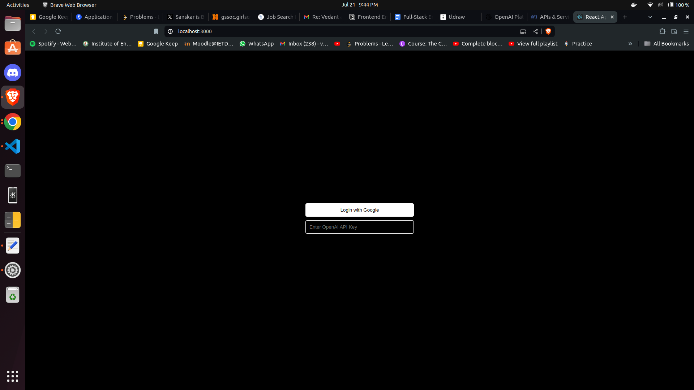
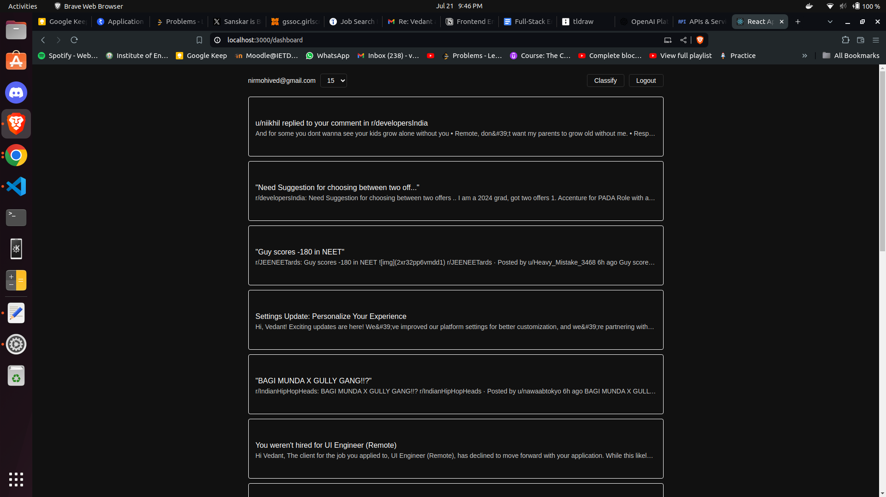
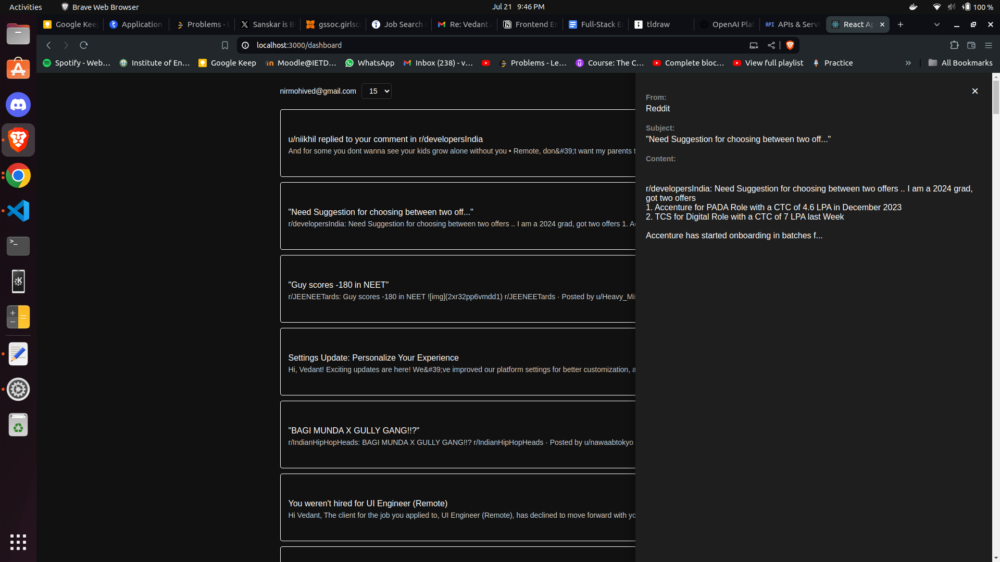
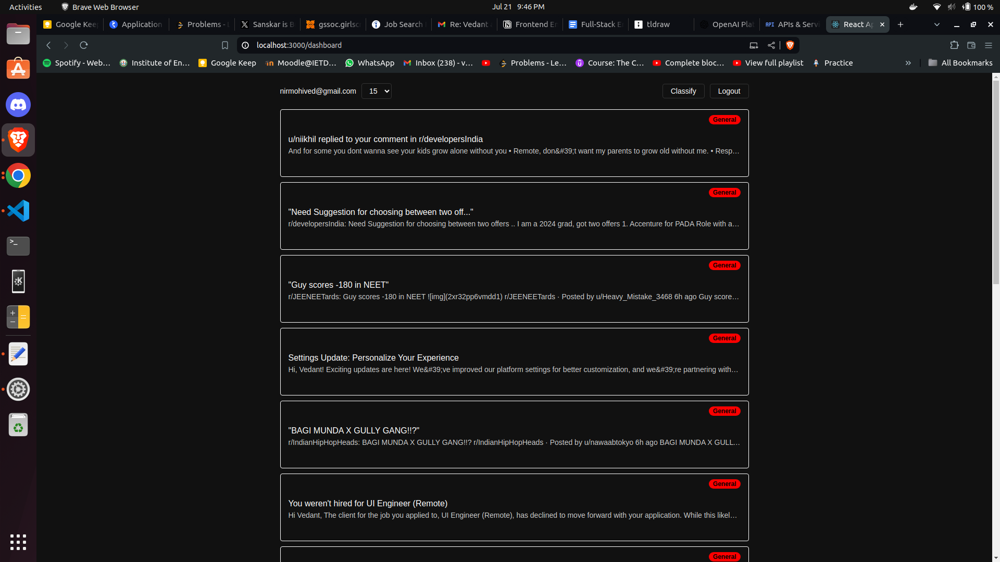

# MagicSlides Email Classification App

## Overview

This full-stack web application allows users to log in using Google OAuth, fetch their recent emails from Gmail, and classify them into different categories using OpenAI GPT-3.5. Built with a React frontend and an Express.js backend, it showcases integration with Google's Gmail API and OpenAI's language model.

## Screenshots

### Login Page

### Dashboard

### Full Email View

### Email Classification

## Features

- Google OAuth authentication
- Fetch recent emails from Gmail (configurable count)
- Classify emails using OpenAI GPT-3.5 into categories:
  - Important
  - Promotional
  - Social
  - Marketing
  - Spam
  - General
- View full email content in a sidebar
- Responsive design for various screen sizes

### Frontend
- React
- React Router
- Styled Components
- Axios for API calls

### Backend
- Express.js
- Google APIs
- OpenAI API
- Langchain.js for AI integration

## Setup and Installation

1. Clone the repository
- git clone https://github.com/Vedantjn/magicslides-assignment
- cd magicslides-assignment

2. Install dependencies for both frontend and backend
- cd client && npm install
- cd ../server && npm install

3. Set up environment variables
- Create `.env` files in both `client` and `server` directories
- Add the following variables:

For `client/.env`:

- REACT_APP_GOOGLE_CLIENT_ID=your_google_client_id
- REACT_APP_API_BASE_URL=http://localhost:5000

For `server/.env`:

- GOOGLE_CLIENT_ID=your_google_client_id
- GOOGLE_CLIENT_SECRET=your_google_client_secret
- FRONTEND_URL=http://localhost:3000
- PORT=5000

4. Start the backend server
- cd server && npm start

5. Start the frontend development server
- cd client && npm start

6. Open `http://localhost:3000` in your browser

## Usage

1. Enter your OpenAI API key
2. Log in with your Google account
3. View your recent emails on the dashboard
4. Click "Classify" to categorize emails
5. Click on an email to view its full content in the sidebar
